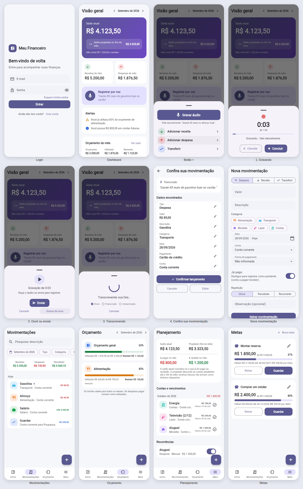
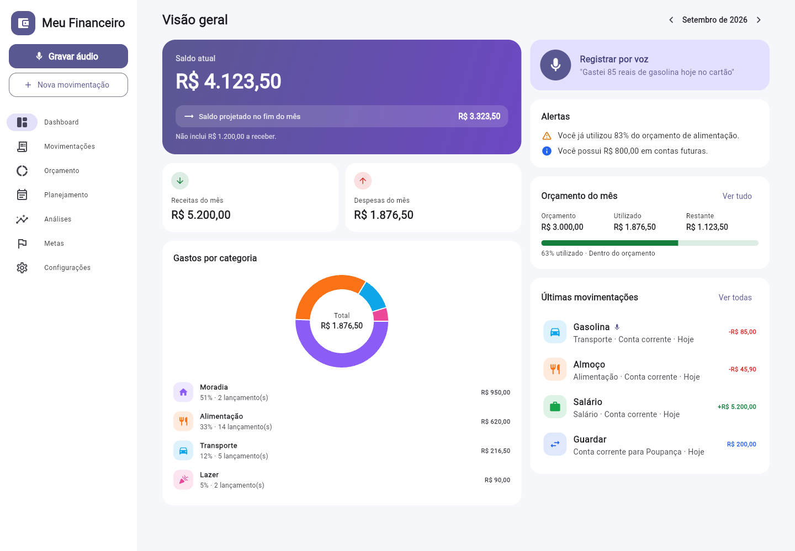

# Meu Financeiro

Aplicativo de finanças pessoais para **web e celular**, com registro de
movimentações **por voz**: toque no microfone, diga "Gastei 85 reais de
gasolina hoje no cartão", confira os dados e confirme.

Nada é salvo sem a confirmação do usuário, e o app funciona normalmente para
quem prefere registrar tudo à mão.

## Telas





## Arquitetura

```
financas/
├── app/                          Flutter (Android, iOS e Web)
│   └── lib/
│       ├── app/                  inicialização, tema, rotas, providers globais
│       ├── core/                 dinheiro (centavos), datas, erros amigáveis, componentes
│       ├── domain/
│       │   ├── models/           movimentação, rascunho, contas, categorias, extração da IA…
│       │   └── finance/          regras: orçamento, alertas, metas
│       ├── data/repositories/    acesso ao Supabase (interfaces + implementações)
│       └── features/
│           ├── auth/             cadastro, login, recuperação e troca de senha
│           ├── shell/            menu lateral (desktop) / barra inferior + "+" (celular)
│           ├── dashboard/        saldo atual, projetado, receitas, despesas, orçamento, gráfico, alertas
│           ├── transactions/     nova movimentação, edição, histórico com busca e filtros
│           ├── audio/            gravação, estados do áudio e tela "Confira sua movimentação"
│           ├── budget/           limites mensais por categoria
│           ├── planning/         contas futuras, vencimentos, recorrências
│           ├── insights/         análises com IA
│           ├── goals/            metas financeiras
│           └── settings/         perfil, contas, categorias, sair
├── supabase/
│   ├── migrations/               esquema, RLS, regras financeiras (PostgreSQL)
│   ├── functions/                Edge Functions (Deno/TypeScript)
│   │   ├── transcribe-audio/     áudio → texto (pt-BR)
│   │   ├── extract-transaction/  texto → dados estruturados (Claude) + conferência
│   │   ├── financial-insights/   análises com os números reais
│   │   └── _shared/              interpretação pt-BR, validação, HTTP, IA
│   └── tests/                    testes SQL (RLS, idempotência, saldos, parcelas…)
└── .github/workflows/ci.yml      análise e testes a cada push
```

**Tecnologias:** Flutter 3.47 · Riverpod 3 · go_router · Supabase (Auth,
PostgreSQL, Edge Functions) · Claude (Anthropic) para extração e análises ·
transcrição via API de Speech-to-Text (padrão: OpenAI `gpt-4o-transcribe`,
idioma `pt`).

### Fluxo do áudio

1. O app gera um **ID de sessão** (UUID) e grava até **60 s**, mostrando a
   duração. Dá para cancelar e ouvir antes de enviar.
2. `transcribe-audio` recebe o áudio, confere o usuário, a duração, o tamanho
   e o formato, transcreve em pt-BR e guarda **só a transcrição**. O áudio não
   é armazenado.
3. `extract-transaction` envia a transcrição ao Claude, que devolve um JSON no
   formato combinado. Depois o backend **confere tudo contra a fala**:
   - um valor que não aparece na fala é descartado e o app pergunta "Qual foi o valor?";
   - uma correção ("150... não, 115") sempre pede confirmação;
   - se não houver data na fala, a data é hoje;
   - categoria e conta só valem se existirem no cadastro do usuário;
   - uma transferência entre contas próprias nunca vira receita nem despesa;
   - se faltar o motivo de um pagamento ("Paguei 120 para João"), o app pergunta "Esse pagamento foi referente a quê?".
4. O app mostra **"Confira sua movimentação"** com todos os campos editáveis e
   os botões *Cancelar*, *Editar* e *Confirmar lançamento*.
5. Ao confirmar, `create_transaction` salva a movimentação usando o ID da
   sessão como **chave de idempotência**. Tocar duas vezes nunca cria dois
   lançamentos. O dashboard atualiza em seguida.

Estados: `recording`, `uploading`, `transcribing`, `extracting`,
`needs_review`, `saving`, `completed`, `failed` e `cancelled`, cada um com uma
mensagem própria.

Sem `ANTHROPIC_API_KEY`, a extração usa um interpretador por regras em pt-BR
(valores por extenso, datas relativas, parcelas, formas de pagamento). Ele
passa pelas mesmas conferências.

## Banco de dados

Tabelas: `users`, `accounts`, `transactions`, `categories`, `budgets`,
`recurring_transactions`, `installments`, `financial_goals`,
`audio_sessions` e `ai_insights`.

- Todas as chaves são UUID, e os **valores ficam em centavos** (`bigint`), sem erro de arredondamento.
- **RLS** está ativo em todas as tabelas: cada usuário só vê e altera as próprias linhas. O papel `anon` não tem acesso.
- Chaves estrangeiras compostas `(user_id, id)` impedem que um lançamento
  aponte para a conta ou a categoria de outra pessoa, mesmo com um UUID forjado.
- `create_transaction(payload)` é idempotente. Ela valida os dados, cria as
  parcelas (a sobra de centavos vai para a primeira) e as recorrências, e
  marca a sessão de áudio como concluída.
- **Saldo atual** = saldo inicial das contas + receitas pagas − despesas pagas.
  Transferências somam zero.
- **Saldo projetado** = saldo atual − despesas pendentes até o fim do mês.
  Receitas futuras aparecem à parte e **não** contam como dinheiro disponível.
- `materialize_recurring` gera as próximas ocorrências das recorrências como pendentes.
- Há também as funções `dashboard_summary`, `spending_by_category`,
  `budget_status` e `monthly_category_totals`.

## Como rodar

### 1. Supabase

```bash
# com o Supabase CLI instalado e logado
supabase link --project-ref SEU_PROJETO
supabase db push                         # aplica supabase/migrations
cp supabase/functions/.env.example supabase/functions/.env   # preencha as chaves
supabase secrets set --env-file supabase/functions/.env
supabase functions deploy transcribe-audio
supabase functions deploy extract-transaction
supabase functions deploy financial-insights
```

No painel do Supabase, em **Authentication → URL Configuration**, adicione
`br.com.meufinanceiro://login-callback` e a URL do site aos *Redirect URLs*.
É isso que faz funcionar a confirmação de e-mail e a recuperação de senha.

As chaves de IA (`ANTHROPIC_API_KEY`, `OPENAI_API_KEY`) existem **somente**
como secrets das Edge Functions. O app só conhece a URL e a chave pública
(`anon`) do Supabase.

### 2. App

```bash
cd app
flutter pub get
flutter run -d chrome \
  --dart-define=SUPABASE_URL=https://SEU_PROJETO.supabase.co \
  --dart-define=SUPABASE_ANON_KEY=SUA_CHAVE_ANON
# celular: troque -d chrome pelo aparelho/emulador
# build web: flutter build web --release --dart-define=...
```

## Testes

| Onde | Comando | O que cobre |
|---|---|---|
| App | `cd app && flutter test` | dinheiro em centavos, validação de receita/despesa/transferência, parcelas, recorrência, extração → rascunho, alertas de orçamento, metas, fluxo completo do áudio (estados, 60 s, permissão, cancelamento, falhas, duplo toque), telas de login/cadastro/recuperação, formulário, confirmação do áudio, layout celular/desktop, dashboard |
| Edge Functions | `cd supabase/functions && npm test` | números por extenso, datas relativas, correções, parcelas, transferências, valores inventados pela IA, perguntas de esclarecimento, análises sem números inventados |
| Banco | `PGHOST=localhost PGUSER=postgres PGPASSWORD=... supabase/tests/run.sh` | RLS entre usuários, chaves compostas, anon sem acesso, idempotência (manual e áudio), saldo atual e projetado, transferências, parcelas, recorrências, orçamento |

O CI (`.github/workflows/ci.yml`) roda as três suítes a cada push.
